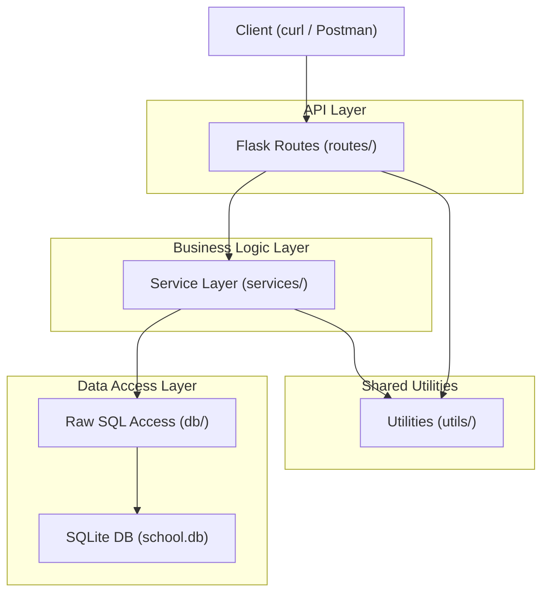
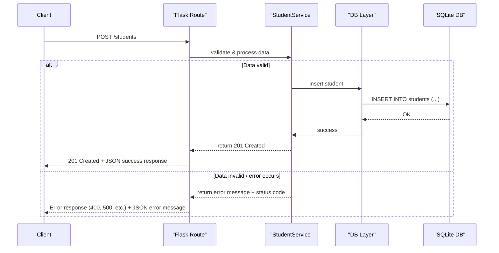

# Architecture

## Overview

This project is a RESTful API built with Flask for managing a school database system. It supports typical operations like adding, updating, reading, and archiving entities such as students, instructors, departments, courses, and more.

The architecture follows a layered approach, separating routing, business logic, and database access.

## Component Diagram



## Key Components

- Client: Any tool or user agent—like Postman, curl, or a web browser—used to send HTTP requests to the API.
- Flask API Routes: Defines HTTP endpoints (e.g., /students, /courses) that handle requests, parse inputs, and send responses.
- Service Layer: Contains business logic such as data validation, processing rules, and orchestration between routes and the database layer.
- Database Layer: Responsible for executing raw SQL queries or ORM operations to interact with the SQLite database.
- SQLite: The persistent database that stores all application data according to your defined schema.

## Request Flow



## Folder Structure

```plaintext
project/
├── run.py                      # Flask app entry point
├── app/                        # Main application package
│   ├── __init__.py             # App factory, extensions initialization
│   ├── routes/                 # Controller layer (API endpoints)
│   │   ├── student.py
│   │   ├── instructor.py
│   │   └── ...
│   ├── services/               # Business logic layer
│   │   ├── student.py
│   │   ├── instructor.py
│   │   └── ...
│   ├── models/                 # Data models (dataclasses or schemas)
│   │   ├── student.py
│   │   ├── instructor.py
│   │   └── ...
│   ├── utils/                  # Reusable helpers
│   │   ├── conversions.py
│   │   └── ...
├── db/                        # Database layer (SQL helpers, connections)
├── tests/                     # Unit and integration tests
│   ├── test_students.py
│   └── ...
├── docs/                      # Project documentation
├── requirements.txt           # Python dependencies
├── Dockerfile                 # Docker image build instructions
├── Dockerfile.multi-stage     # Multi-stage Docker build for smaller images
├── entrypoint.sh              # Docker container entrypoint script
└── Makefile                   # Convenience commands (build, run, test)
```

## Tools Used

- Flask – API framework
- SQLite – Lightweight DB
- Docker – Containerization
- Gunicorn – WSGI server
- GitHub Actions – CI for format, test, coverage, and markdown linting
- Render – Deployment platform