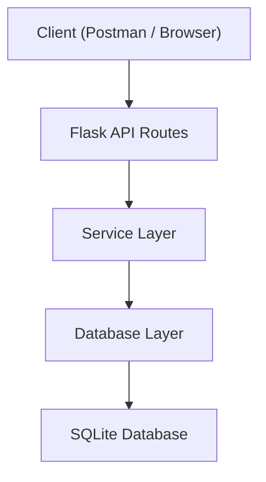
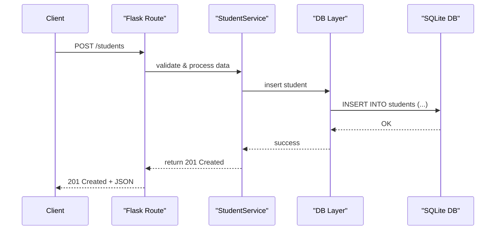

# Architecture

## Overview

This project is a RESTful API built with Flask for managing a school database system. It supports typical operations like adding, updating, reading, and archiving entities such as students, instructors, departments, courses, and more.

The architecture follows a layered approach, separating routing, business logic, and database access.

## Component Diagram



## Key Components

- Client: Any tool like Postman or browser used to send HTTP requests.
- Flask API Routes: Defines endpoints for each resource (e.g., /students, /courses).
- Service Layer: Contains the business logic, validations, and orchestration of data operations.
- Database Layer: Executes raw SQL or ORM-based interactions with the SQLite database.
- SQLite: Stores all data persistently using the defined school schema.

## Request Flow



## Folder Structure

```plaintext
project/
├── app.py                    # Flask app entry point
├── routes/                   # Controller layer
│   ├── students.py
│   ├── instructors.py
│   └── ...
├── models/                   # Model layer
│   ├── student.py
│   ├── instructor.py
│   └── ...
├── db/                       # Database setup
├── utils/                    # Utility/helper functions
├── docs/                     # Documentation
├── requirements.txt          # Python dependencies
├── Dockerfile                # Container image build instructions
├── Dockerfile.multi-stage    # Multi-stage Docker build for smaller images
├── entrypoint.sh             # Docker container entry script
├── Makefile                  # Convenience commands (build, run, test)
└── tests/                    # Unit and integration tests
```

## Tools Used

- Flask – API framework
- SQLite – Lightweight DB
- Docker – Containerization
- Gunicorn – WSGI server
- GitHub Actions – CI for markdown linting
- Render – Deployment platform