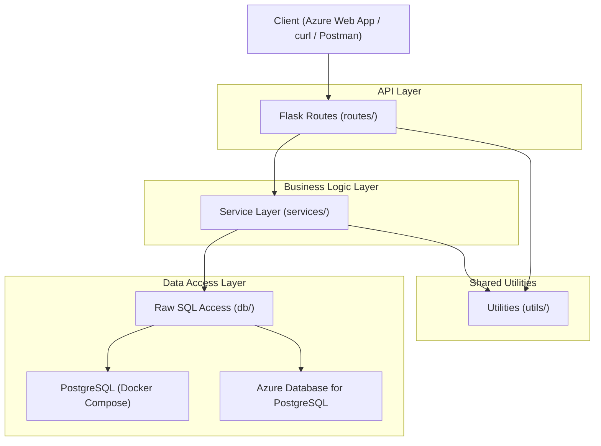
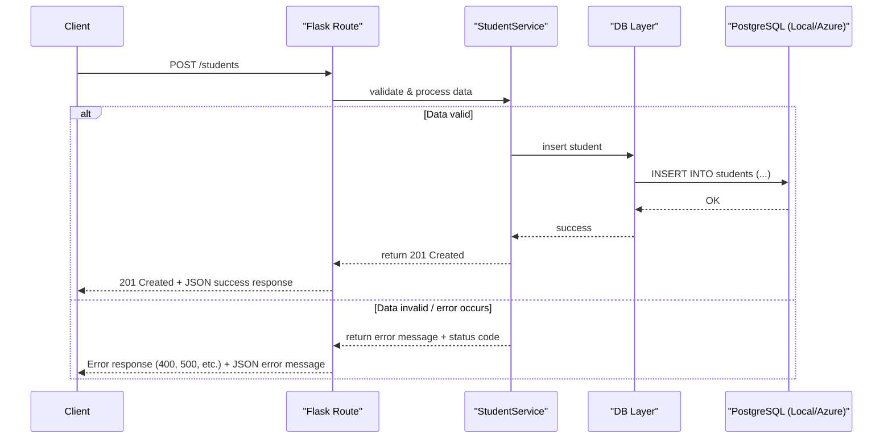
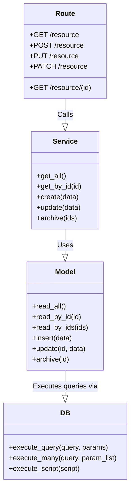

# Architecture

## Overview

This project is a RESTful API built with Flask for managing a school database system. It supports typical operations like adding, updating, reading, and archiving entities such as students, instructors, departments, courses, and more.

The architecture follows a layered approach, separating routing, business logic, and database access.

## Technology Stack

- Flask – API framework
- PostgreSQL (Docker container) – Local development
- Azure Database for PostgreSQL – Cloud database (production)
- Azure Container Registry (ACR) – Container image storage
- Azure Web App – Frontend/client application
- Docker – Containerization
- Gunicorn – WSGI server
- GitHub Actions – CI for format, test, coverage, and markdown linting

## Component Diagram



## Key Components

- Client: Any tool or user agent—like Postman, curl, or a web browser—used to send HTTP requests to the API.
- Flask API Routes: Defines HTTP endpoints (e.g., /students, /courses) that handle requests, parse inputs, and send responses.
- Service Layer: Contains business logic such as data validation, processing rules, and orchestration between routes and the database layer.
- Database Layer: Responsible for executing raw SQL queries or ORM operations to interact with the PostgreSQL database (local via Docker Compose, production via Azure Database for PostgreSQL).
- PostgreSQL: The persistent database that stores all application data according to your defined schema. Local development uses Docker Compose, while production uses Azure Database for PostgreSQL.

## Request Flow



**Note**: This request flow pattern applies to all CRUD operations with the following variations:

**HTTP Methods and Endpoints:**

- `GET /students` (read all)
- `GET /students/{id}` (read by ID)
- `POST /students` (create)
- `PUT /students` (update)
- `PATCH /students` (archive/soft delete)

**SQL Operations:**

- `INSERT INTO students (...)` (create)
- `SELECT * FROM students WHERE id = ?` (read)
- `UPDATE students SET ... WHERE id = ?` (update/patch)

**Response Status Codes:**

- `201 Created` (POST - successful creation)
- `200 OK` (GET, PUT, PATCH, DELETE - successful operations)
- `400 Bad Request` (invalid data or missing required fields)
- `404 Not Found` (when resource doesn't exist)
- `422 Unprocessable Entity` (archive operations when resource not found)
- `500 Internal Server Error` (unexpected server errors)

## Class Diagram (Generic)

This diagram illustrates the typical class structure and interactions for a single resource (e.g., "Assignment"). It shows how a request flows from the routing layer down to the database.

- **Route**: Handles HTTP requests, calls the appropriate service method, and formats the response. Maps to files in `app/routes/`.
- **Service**: Contains the core business logic and orchestrates data operations. Maps to files in `app/services/`.
- **Model**: Acts as a data access layer, directly responsible for database queries. Maps to files in `app/models/`.
- **DB**: A singleton class that manages the database connection pool and executes raw SQL queries. Maps to `db/database.py`.



## Folder Structure

```plaintext
```plaintext
project/
├── run.py                      # Flask app entry point
├── app/                        # Main application package
│   ├── __init__.py             # App factory, extensions initialization
│   ├── models/                 # Data models (schemas, dataclasses)
│   ├── routes/                 # API endpoints (controllers)
│   ├── services/               # Business logic layer
│   ├── utils/                  # Reusable helpers
├── db/                         # Database layer
│   ├── data.py                 # Initial data population
│   ├── database.py             # Main DB connection logic
│   ├── db_utils.py             # Helper functions for DB
│   ├── init.py                 # DB initialization script
│   ├── schema.sql              # DB schema
├── scripts/                    # Scripts to run and automate project tasks
├── tests/                      # Unit tests
├── docs/                       # Project documentation
├── requirements.txt            # Python dependencies
├── Dockerfile                  # Single-stage Docker build
├── Dockerfile.multi-stage      # Multi-stage Docker build
├── entrypoint.sh               # Docker container entrypoint script
├── Makefile                    # Convenience commands (build, run, test)
├── api_client.sh               # API testing helper script
├── checklist.md                # Project checklist
└── .github/
    └── workflows/
        └── ci.yml              # CI workflow for format, test, coverage
        └── markdownlint.yml    # CI workflow for format markdown files
```
